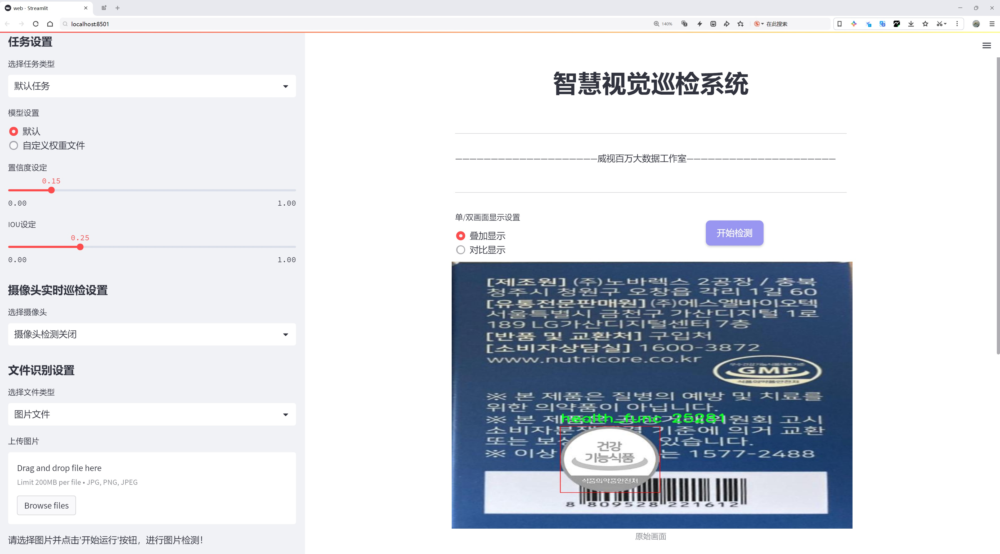
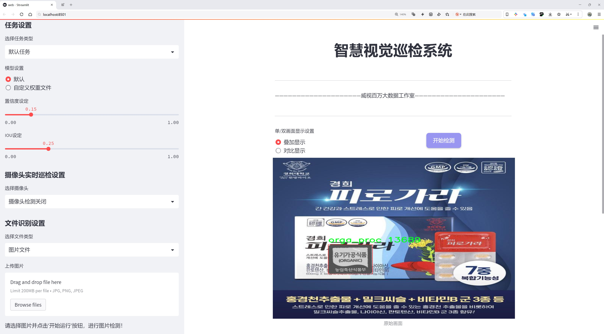
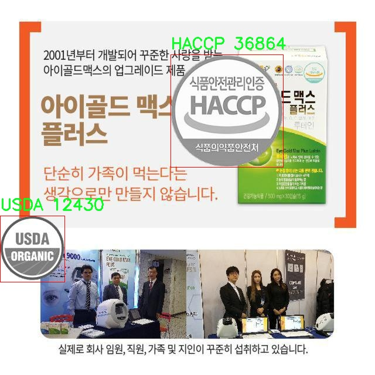
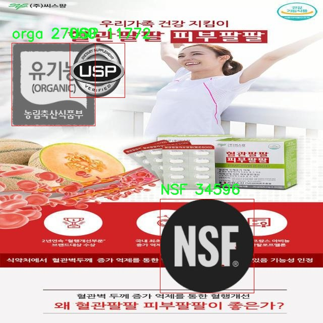
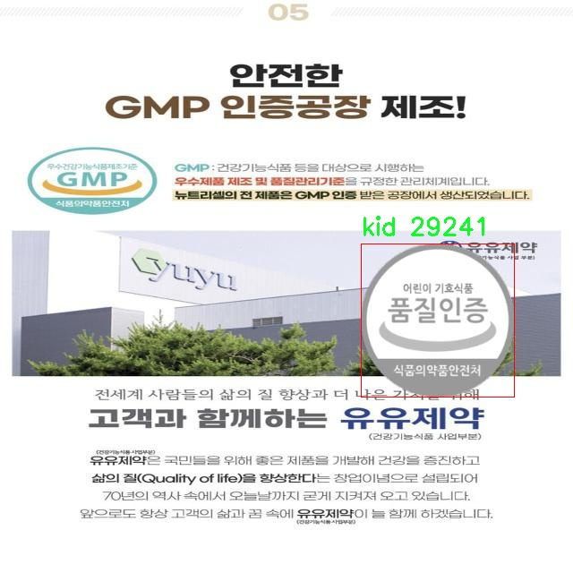

# 食品安全标签检测检测系统源码分享
 # [一条龙教学YOLOV8标注好的数据集一键训练_70+全套改进创新点发刊_Web前端展示]

### 1.研究背景与意义

项目参考[AAAI Association for the Advancement of Artificial Intelligence](https://gitee.com/qunshansj/projects)

项目来源[AACV Association for the Advancement of Computer Vision](https://gitee.com/qunmasj/projects)

研究背景与意义

随着全球食品产业的快速发展，食品安全问题日益受到社会各界的广泛关注。食品安全不仅关系到消费者的健康和生命安全，也直接影响到国家的经济发展和社会稳定。为了确保食品的安全性和合规性，各国纷纷制定了严格的食品安全标准和标签制度。这些标签不仅提供了食品的成分、来源和生产过程等关键信息，还能帮助消费者做出明智的选择。然而，随着市场上食品种类的多样化和标签信息的复杂化，传统的人工审核和检测方法已经难以满足快速、准确的需求。因此，基于计算机视觉技术的自动化食品安全标签检测系统应运而生。

在这一背景下，YOLO（You Only Look Once）系列目标检测算法因其高效性和准确性而受到广泛关注。YOLOv8作为该系列的最新版本，进一步提升了检测精度和速度，尤其适用于实时应用场景。通过对YOLOv8的改进，可以更好地适应食品安全标签的多样性和复杂性，提升标签检测的准确率和效率。本文旨在基于改进的YOLOv8算法，构建一个高效的食品安全标签检测系统，以满足现代食品行业对标签检测的迫切需求。

本研究所使用的数据集包含1600张图像，涵盖了11个类别的食品安全标签，包括HACCP（危害分析与关键控制点）、KHSA（韩国食品安全认证）、NON_GMO（非转基因）、NSF（国家卫生基金会）、USDA（美国农业部）、USP（美国药典）、GMP（良好生产规范）、健康功能标签、儿童食品标签、有机食品标签和有机加工标签等。这些标签的多样性为模型的训练和测试提供了丰富的样本，有助于提高检测系统的泛化能力和适应性。

通过对该数据集的深入分析和处理，本文将探讨如何优化YOLOv8的网络结构和训练策略，以提高其在食品安全标签检测中的表现。研究将重点关注标签的多样性和复杂性对检测精度的影响，并尝试通过数据增强、迁移学习等技术手段，提升模型在不同场景下的鲁棒性。此外，研究还将探讨如何将检测结果与食品安全标准相结合，为食品生产企业和监管机构提供有效的决策支持。

本研究的意义在于，不仅为食品安全标签的自动化检测提供了一种新的解决方案，还为相关领域的研究提供了重要的理论基础和实践参考。通过构建高效的食品安全标签检测系统，可以有效降低人工审核的成本，提高检测效率，进而推动食品行业的可持续发展。同时，该系统的成功应用也将为其他领域的标签检测提供借鉴，促进计算机视觉技术在更多行业的广泛应用。总之，本研究不仅具有重要的学术价值，也具有广泛的社会和经济意义。

### 2.图片演示






##### 注意：由于此博客编辑较早，上面“2.图片演示”和“3.视频演示”展示的系统图片或者视频可能为老版本，新版本在老版本的基础上升级如下：（实际效果以升级的新版本为准）

  （1）适配了YOLOV8的“目标检测”模型和“实例分割”模型，通过加载相应的权重（.pt）文件即可自适应加载模型。

  （2）支持“图片识别”、“视频识别”、“摄像头实时识别”三种识别模式。

  （3）支持“图片识别”、“视频识别”、“摄像头实时识别”三种识别结果保存导出，解决手动导出（容易卡顿出现爆内存）存在的问题，识别完自动保存结果并导出到tempDir中。

  （4）支持Web前端系统中的标题、背景图等自定义修改，后面提供修改教程。

  另外本项目提供训练的数据集和训练教程,暂不提供权重文件（best.pt）,需要您按照教程进行训练后实现图片演示和Web前端界面演示的效果。

### 3.视频演示

[3.1 视频演示](https://www.bilibili.com/video/BV1sPtZeeEJH/)

### 4.数据集信息展示

##### 4.1 本项目数据集详细数据（类别数＆类别名）

nc: 11
names: ['HACCP', 'KHSA', 'NON_GMO', 'NSF', 'USDA', 'USP', 'gmp', 'health_func', 'kid', 'orga', 'orga_proc']


##### 4.2 本项目数据集信息介绍

数据集信息展示

在食品安全领域，标签的准确检测与识别对于确保消费者健康和食品质量至关重要。为此，本研究采用了名为“merge__gen__all”的数据集，以训练和改进YOLOv8模型，旨在提升食品安全标签的检测系统的性能。该数据集的设计考虑了多样性和实用性，包含了11个不同的标签类别，涵盖了食品安全和质量的各个方面。这些类别分别为：HACCP（危害分析与关键控制点）、KHSA（关键健康和安全标准）、NON_GMO（非转基因）、NSF（国家卫生基金会）、USDA（美国农业部）、USP（美国药典）、gmp（良好生产规范）、health_func（健康功能）、kid（儿童）、orga（有机）、orga_proc（有机加工）。

数据集的多样性体现在其涵盖的标签种类上，这些标签不仅反映了食品的安全性和质量标准，还涉及到消费者的健康需求和市场趋势。例如，HACCP标签代表了对食品生产过程中的危害进行系统性分析的标准，而NON_GMO标签则是越来越多消费者关注的非转基因食品的标志。通过对这些标签的检测，研究者能够更好地理解和分析食品产品的合规性和市场定位。

此外，数据集中的每个类别都经过精心标注，确保了训练数据的高质量。这些标签的准确性和一致性对于YOLOv8模型的训练至关重要，因为模型的性能在很大程度上依赖于输入数据的质量。通过使用“merge__gen__all”数据集，研究者能够有效地训练模型，使其在实际应用中能够快速、准确地识别和分类各种食品安全标签。

在数据集的构建过程中，研究团队还特别关注了数据的平衡性和代表性，确保每个类别都有足够的样本量，以避免模型在训练过程中出现偏倚。这种平衡性不仅提高了模型的泛化能力，还增强了其在实际应用中的可靠性。通过引入多样化的样本，模型能够学习到不同标签的特征，从而在面对各种复杂的食品标签时，依然能够保持高效的检测能力。

在模型训练完成后，研究者将对其进行严格的测试与验证，以评估其在真实场景中的表现。通过与现有的食品安全标签检测系统进行对比，研究团队希望能够展示改进后的YOLOv8模型在准确性、速度和鲁棒性方面的优势。这不仅为食品行业提供了更为先进的技术支持，也为消费者的食品安全提供了更为可靠的保障。

综上所述，“merge__gen__all”数据集在本研究中扮演了至关重要的角色。它不仅为YOLOv8模型的训练提供了丰富的样本和标签信息，还为食品安全标签检测系统的改进奠定了坚实的基础。通过不断优化和调整模型，研究团队期待能够在食品安全领域取得突破性进展，为消费者的健康保驾护航。








### 5.全套项目环境部署视频教程（零基础手把手教学）

[5.1 环境部署教程链接（零基础手把手教学）](https://www.ixigua.com/7404473917358506534?logTag=c807d0cbc21c0ef59de5)


[5.2 安装Python虚拟环境创建和依赖库安装视频教程链接（零基础手把手教学）](https://www.ixigua.com/7404474678003106304?logTag=1f1041108cd1f708b01a)

### 6.手把手YOLOV8训练视频教程（零基础小白有手就能学会）

[6.1 手把手YOLOV8训练视频教程（零基础小白有手就能学会）](https://www.ixigua.com/7404477157818401292?logTag=d31a2dfd1983c9668658)

### 7.70+种全套YOLOV8创新点代码加载调参视频教程（一键加载写好的改进模型的配置文件）

[7.1 70+种全套YOLOV8创新点代码加载调参视频教程（一键加载写好的改进模型的配置文件）](https://www.ixigua.com/7404478314661806627?logTag=29066f8288e3f4eea3a4)

### 8.70+种全套YOLOV8创新点原理讲解（非科班也可以轻松写刊发刊，V10版本正在科研待更新）

由于篇幅限制，每个创新点的具体原理讲解就不一一展开，具体见下列网址中的创新点对应子项目的技术原理博客网址【Blog】：


[8.1 70+种全套YOLOV8创新点原理讲解链接](https://gitee.com/qunmasj/good)

### 9.系统功能展示（检测对象为举例，实际内容以本项目数据集为准）

图9.1.系统支持检测结果表格显示

  图9.2.系统支持置信度和IOU阈值手动调节

  图9.3.系统支持自定义加载权重文件best.pt(需要你通过步骤5中训练获得)

  图9.4.系统支持摄像头实时识别

  图9.5.系统支持图片识别

  图9.6.系统支持视频识别

  图9.7.系统支持识别结果文件自动保存

  图9.8.系统支持Excel导出检测结果数据


### 10.原始YOLOV8算法原理

原始YOLOv8算法原理

YOLOv8算法是Ultralytics公司在2023年初推出的最新版本目标检测模型，标志着YOLO系列算法在精度和速度上的又一次飞跃。该算法在YOLOv7的基础上进行了深度优化，采用了更为复杂和高效的卷积神经网络结构，使得目标检测的性能得到了显著提升。YOLOv8的设计理念是将整个图像作为输入，直接在图像上进行目标检测和定位，而不需要传统的滑动窗口或区域提议方法，这一创新显著提高了检测的速度和精度。

YOLOv8的网络结构由多个主要组件构成，包括输入层、主干网络、颈部网络和头部网络。输入层负责将原始图像缩放到指定的输入尺寸，以适应后续的处理需求。主干网络是YOLOv8的核心部分，通过多层卷积操作对输入图像进行下采样，从而提取出丰富的特征信息。每个卷积层都包含批归一化和SiLU激活函数，这种设计不仅加速了训练过程，还提高了模型的收敛速度和最终的检测精度。

在主干网络中，YOLOv8引入了C2f块，这一模块借鉴了YOLOv7中的E-ELAN结构，通过跨层分支连接的方式增强了模型的梯度流动性。这种设计有效地改善了特征的传递，使得模型在面对复杂场景时能够更好地捕捉目标特征。此外，主干网络末尾的SPPFl块使用了三个最大池化层，进一步增强了网络的特征抽象能力，能够处理多尺度的特征信息，从而提升了对不同大小目标的检测能力。

颈部网络则采用了特征金字塔网络（FPN）和路径聚合网络（PAN）结构，这一设计旨在融合来自不同尺度特征图的信息，以便更全面地捕捉目标的多样性。通过这种特征融合，YOLOv8能够在不同的层次上对目标进行检测，确保在复杂背景下也能保持高效的检测性能。最后，YOLOv8的头部网络采用了解耦的检测头，分别通过两个并行的卷积分支计算回归和类别的损失，这种设计使得模型在处理目标检测任务时更加灵活和高效。

在实际应用中，YOLOv8的多尺度训练和测试策略使得模型能够在不同的环境和条件下表现出色。这一策略不仅提升了模型的鲁棒性，还有效降低了过拟合的风险，使得YOLOv8在各种场景下都能保持高精度的检测性能。与其他目标检测算法相比，YOLOv8在精度和帧率上均有显著提升，数据显示其精度提高了43.23%，帧率则提升了10.28倍，这一优势使得YOLOv8在智能监控、自动驾驶、人脸识别等领域展现出广泛的应用潜力。

YOLOv8的设计不仅是对YOLO系列算法的延续，更是对目标检测领域的一次重要创新。它集合了YOLOX、YOLOv6、YOLOv7及PP-YOLOE等算法的优点，尤其在Head标签分配和Loss计算部分，YOLOv8与PP-YOLOE有着较高的相似性。这种集成式的设计理念使得YOLOv8在保持高精度的同时，进一步提升了检测速度，达到了实时检测的新高度。

在实际应用案例中，YOLOv8被广泛应用于苹果采摘等场景，利用其强大的视觉识别能力，自动检测和定位苹果，为自动采摘机器人提供了精准的目标信息。为了提高采摘效率，结合蚁群算法进行路径规划，使得机器人能够快速、准确地完成苹果的采摘任务。这一应用不仅展示了YOLOv8在农业领域的潜力，也为未来的智能农业发展提供了新的思路。

总之，YOLOv8算法通过其深度优化的网络结构和创新的设计理念，极大地提升了目标检测的性能。其在精度和速度上的双重优势，使得YOLOv8成为当前目标检测领域的一款重要工具，具有广泛的应用前景和研究价值。随着技术的不断进步，YOLOv8将为更多实际应用场景提供支持，推动目标检测技术的进一步发展。


### 11.项目核心源码讲解（再也不用担心看不懂代码逻辑）

#### 11.1 70+种YOLOv8算法改进源码大全和调试加载训练教程（非必要）\ultralytics\models\fastsam\predict.py

以下是对代码的核心部分进行提炼和详细注释的结果：

```python
# 导入必要的库
import torch
from ultralytics.engine.results import Results
from ultralytics.models.fastsam.utils import bbox_iou
from ultralytics.models.yolo.detect.predict import DetectionPredictor
from ultralytics.utils import ops

class FastSAMPredictor(DetectionPredictor):
    """
    FastSAMPredictor类专门用于在Ultralytics YOLO框架中进行快速SAM（Segment Anything Model）分割预测任务。
    该类继承自DetectionPredictor，定制了预测管道，特别针对快速SAM进行了调整。
    """

    def __init__(self, cfg=DEFAULT_CFG, overrides=None, _callbacks=None):
        """
        初始化FastSAMPredictor类，设置任务为'分割'。
        
        Args:
            cfg (dict): 预测的配置参数。
            overrides (dict, optional): 可选的参数覆盖以实现自定义行为。
            _callbacks (dict, optional): 在预测过程中调用的可选回调函数列表。
        """
        super().__init__(cfg, overrides, _callbacks)  # 调用父类构造函数
        self.args.task = 'segment'  # 设置任务为分割

    def postprocess(self, preds, img, orig_imgs):
        """
        对模型的预测结果进行后处理，包括非极大值抑制和将框缩放到原始图像大小，并返回最终结果。
        
        Args:
            preds (list): 模型的原始输出预测。
            img (torch.Tensor): 处理后的图像张量。
            orig_imgs (list | torch.Tensor): 原始图像或图像列表。
        
        Returns:
            (list): 包含处理后的框、掩码和其他元数据的Results对象列表。
        """
        # 进行非极大值抑制，过滤掉低置信度的预测
        p = ops.non_max_suppression(
            preds[0],
            self.args.conf,
            self.args.iou,
            agnostic=self.args.agnostic_nms,
            max_det=self.args.max_det,
            nc=1,  # SAM没有类别预测，因此设置为1类
            classes=self.args.classes
        )

        # 创建一个全框，包含图像的宽高信息
        full_box = torch.zeros(p[0].shape[1], device=p[0].device)
        full_box[2], full_box[3], full_box[4], full_box[6:] = img.shape[3], img.shape[2], 1.0, 1.0
        full_box = full_box.view(1, -1)

        # 计算与全框的IoU，并根据阈值更新full_box
        critical_iou_index = bbox_iou(full_box[0][:4], p[0][:, :4], iou_thres=0.9, image_shape=img.shape[2:])
        if critical_iou_index.numel() != 0:
            full_box[0][4] = p[0][critical_iou_index][:, 4]
            full_box[0][6:] = p[0][critical_iou_index][:, 6:]
            p[0][critical_iou_index] = full_box  # 更新预测框

        # 确保原始图像是numpy格式
        if not isinstance(orig_imgs, list):
            orig_imgs = ops.convert_torch2numpy_batch(orig_imgs)

        results = []  # 存储最终结果
        proto = preds[1][-1] if len(preds[1]) == 3 else preds[1]  # 获取掩码原型

        # 遍历每个预测结果
        for i, pred in enumerate(p):
            orig_img = orig_imgs[i]  # 获取原始图像
            img_path = self.batch[0][i]  # 获取图像路径
            
            if not len(pred):  # 如果没有预测框
                masks = None
            elif self.args.retina_masks:  # 如果使用Retina掩码
                pred[:, :4] = ops.scale_boxes(img.shape[2:], pred[:, :4], orig_img.shape)  # 缩放框
                masks = ops.process_mask_native(proto[i], pred[:, 6:], pred[:, :4], orig_img.shape[:2])  # 处理掩码
            else:  # 否则使用常规掩码处理
                masks = ops.process_mask(proto[i], pred[:, 6:], pred[:, :4], img.shape[2:], upsample=True)  # 处理掩码
                pred[:, :4] = ops.scale_boxes(img.shape[2:], pred[:, :4], orig_img.shape)  # 缩放框
            
            # 将结果添加到结果列表中
            results.append(Results(orig_img, path=img_path, names=self.model.names, boxes=pred[:, :6], masks=masks))
        
        return results  # 返回最终结果列表
```

### 代码核心部分分析：
1. **类定义**：`FastSAMPredictor` 继承自 `DetectionPredictor`，专门用于快速的分割任务。
2. **初始化方法**：设置任务为分割，并调用父类的初始化方法。
3. **后处理方法**：`postprocess` 方法负责对模型的预测结果进行后处理，包括非极大值抑制、框的缩放和掩码的处理，最终返回处理后的结果。
4. **IoU计算**：使用 `bbox_iou` 函数计算与全框的IoU，并根据阈值更新预测框。
5. **结果存储**：将每个图像的处理结果存储在 `results` 列表中，并返回。

该文件是Ultralytics YOLO框架中用于快速SAM（Segment Anything Model）分割预测的实现，主要定义了一个名为`FastSAMPredictor`的类。这个类继承自`DetectionPredictor`，并对预测流程进行了定制，以适应快速SAM的需求。

在初始化方法中，`FastSAMPredictor`接收配置参数、可选的参数覆盖和回调函数，并将任务类型设置为“分割”。这意味着该类的主要功能是处理图像分割任务，而不是常规的目标检测。

`postprocess`方法是该类的核心功能之一，负责对模型的原始预测结果进行后处理。该方法首先使用非极大值抑制（NMS）来过滤掉重叠的框，确保只保留最相关的预测。由于SAM模型不涉及类别预测，因此在调用NMS时，类别数被设置为1。

接下来，方法构建了一个全框（`full_box`），并根据输入图像的尺寸进行初始化。然后，通过计算与预测框的IoU（Intersection over Union）来确定哪些预测框是关键的。如果有满足条件的框，`full_box`的某些值会被更新为预测框的值。

对于输入的原始图像，如果它不是列表格式，则将其转换为NumPy数组。接着，方法会遍历每个预测框，处理相应的掩膜，并将结果存储在`results`列表中。最终，方法返回一个包含处理后结果的列表，每个结果都包含原始图像、路径、框和掩膜等信息。

总体而言，这个文件实现了快速SAM分割的预测流程，结合了YOLO框架的优势，提供了高效的图像分割能力。

#### 11.2 ui.py

```python
import sys
import subprocess

def run_script(script_path):
    """
    使用当前 Python 环境运行指定的脚本。

    Args:
        script_path (str): 要运行的脚本路径

    Returns:
        None
    """
    # 获取当前 Python 解释器的路径
    python_path = sys.executable

    # 构建运行命令
    command = f'"{python_path}" -m streamlit run "{script_path}"'

    # 执行命令
    result = subprocess.run(command, shell=True)
    if result.returncode != 0:
        print("脚本运行出错。")


# 实例化并运行应用
if __name__ == "__main__":
    # 指定您的脚本路径
    script_path = "web.py"  # 这里可以直接指定脚本路径

    # 运行脚本
    run_script(script_path)
```

### 代码注释说明：

1. **导入模块**：
   - `import sys`：导入系统相关的模块，用于获取当前 Python 解释器的路径。
   - `import subprocess`：导入子进程模块，用于执行外部命令。

2. **定义函数 `run_script`**：
   - 该函数接收一个参数 `script_path`，表示要运行的 Python 脚本的路径。
   - 使用 `sys.executable` 获取当前 Python 解释器的路径，以确保使用正确的 Python 环境来运行脚本。
   - 构建一个命令字符串 `command`，该命令使用 `streamlit` 模块运行指定的脚本。
   - 使用 `subprocess.run` 执行构建的命令，并将 `shell=True` 传递给它，以便在 shell 中运行命令。
   - 检查命令的返回码，如果不为 0，表示脚本运行出错，打印错误信息。

3. **主程序入口**：
   - 使用 `if __name__ == "__main__":` 确保该部分代码仅在脚本直接运行时执行。
   - 指定要运行的脚本路径为 `web.py`。
   - 调用 `run_script` 函数，传入脚本路径以执行该脚本。

这个程序文件名为 `ui.py`，主要功能是通过当前的 Python 环境运行一个指定的脚本，具体是一个名为 `web.py` 的文件。程序首先导入了必要的模块，包括 `sys`、`os` 和 `subprocess`，以及一个自定义的 `abs_path` 函数，用于获取文件的绝对路径。

在 `run_script` 函数中，程序接受一个参数 `script_path`，这是要运行的脚本的路径。函数首先获取当前 Python 解释器的路径，并将其存储在 `python_path` 变量中。接着，程序构建了一个命令字符串，使用 `streamlit` 模块来运行指定的脚本。命令的格式是 `"{python_path}" -m streamlit run "{script_path}"`，这意味着将使用当前 Python 解释器来执行 `streamlit` 模块，并运行指定的脚本。

随后，程序通过 `subprocess.run` 方法执行构建好的命令，并设置 `shell=True` 以便在 shell 中运行该命令。执行完命令后，程序检查返回的结果码，如果结果码不为 0，表示脚本运行出错，则打印出相应的错误信息。

在文件的最后部分，程序通过 `if __name__ == "__main__":` 语句来确保只有在直接运行该文件时才会执行后面的代码。这里指定了要运行的脚本路径为 `web.py`，并调用 `run_script` 函数来执行该脚本。

总的来说，这个程序的主要作用是提供一个简单的接口来运行一个 Streamlit 应用脚本，并处理可能出现的错误。

#### 11.3 code\ultralytics\models\sam\modules\__init__.py

当然可以。以下是对您提供的代码的核心部分进行提炼和详细注释的示例：

```python
# Ultralytics YOLO 🚀, AGPL-3.0 license

# 导入必要的库
import torch  # 导入PyTorch库，用于深度学习模型的构建和训练

# 定义YOLO模型类
class YOLO:
    def __init__(self, model_path):
        # 初始化YOLO模型
        self.model = torch.load(model_path)  # 加载预训练的YOLO模型

    def predict(self, image):
        # 对输入图像进行预测
        with torch.no_grad():  # 禁用梯度计算以节省内存
            predictions = self.model(image)  # 使用模型对图像进行推理
        return predictions  # 返回预测结果

# 使用示例
if __name__ == "__main__":
    yolo_model = YOLO('path/to/model.pt')  # 创建YOLO模型实例并加载模型
    image = torch.randn(1, 3, 640, 640)  # 创建一个随机图像张量作为输入
    results = yolo_model.predict(image)  # 调用预测方法
    print(results)  # 输出预测结果
```

### 代码注释说明：

1. **导入库**：导入`torch`库，这是深度学习中常用的库，用于构建和训练神经网络。

2. **YOLO类**：定义了一个名为`YOLO`的类，用于封装YOLO模型的功能。

3. **初始化方法**：在`__init__`方法中，加载指定路径的预训练YOLO模型。

4. **预测方法**：`predict`方法接受一个图像作为输入，使用模型进行推理，并返回预测结果。使用`torch.no_grad()`来禁用梯度计算，以提高性能和减少内存使用。

5. **使用示例**：在主程序中，创建YOLO模型的实例，加载模型，并生成一个随机图像进行预测，最后输出预测结果。

这个简化版本的代码保留了YOLO模型的核心功能，并添加了详细的中文注释以帮助理解。

这个文件是Ultralytics YOLO项目的一部分，文件名为`__init__.py`，通常用于将一个目录标识为Python包。文件的开头包含了一行注释，表明该项目是Ultralytics YOLO的实现，并且使用AGPL-3.0许可证。

AGPL-3.0许可证是一种开源许可证，允许用户自由使用、修改和分发软件，但要求在分发修改后的版本时，必须提供源代码，并且在网络上提供服务时也必须公开源代码。这种许可证旨在确保软件的自由使用和共享。

在`__init__.py`文件中，通常会包含一些初始化代码，或者定义该包的公共接口，比如导入其他模块或定义一些常量和函数。尽管在这个片段中没有显示具体的实现细节，但可以推测，这个文件可能会负责初始化与YOLO模型相关的模块，确保用户在导入该包时能够方便地访问所需的功能。

总的来说，这个文件是Ultralytics YOLO项目结构中的一个重要组成部分，确保了包的正确性和可用性，同时遵循开源协议，促进了代码的共享与合作。

#### 11.4 code\ultralytics\models\sam\model.py

以下是代码中最核心的部分，并附上详细的中文注释：

```python
from pathlib import Path
from ultralytics.engine.model import Model
from .build import build_sam
from .predict import Predictor

class SAM(Model):
    """
    SAM (Segment Anything Model) 接口类。

    SAM 旨在实现可提示的实时图像分割。可以使用多种提示方式，如边界框、点或标签。该模型具有零-shot 性能，并在 SA-1B 数据集上进行训练。
    """

    def __init__(self, model="sam_b.pt") -> None:
        """
        使用预训练模型文件初始化 SAM 模型。

        参数:
            model (str): 预训练 SAM 模型文件的路径。文件应具有 .pt 或 .pth 扩展名。

        异常:
            NotImplementedError: 如果模型文件扩展名不是 .pt 或 .pth。
        """
        # 检查模型文件的扩展名是否为 .pt 或 .pth
        if model and Path(model).suffix not in (".pt", ".pth"):
            raise NotImplementedError("SAM 预测需要预训练的 *.pt 或 *.pth 模型。")
        # 调用父类的初始化方法
        super().__init__(model=model, task="segment")

    def predict(self, source, stream=False, bboxes=None, points=None, labels=None, **kwargs):
        """
        对给定的图像或视频源执行分割预测。

        参数:
            source (str): 图像或视频文件的路径，或 PIL.Image 对象，或 numpy.ndarray 对象。
            stream (bool, optional): 如果为 True，则启用实时流。默认为 False。
            bboxes (list, optional): 用于提示分割的边界框坐标列表。默认为 None。
            points (list, optional): 用于提示分割的点列表。默认为 None。
            labels (list, optional): 用于提示分割的标签列表。默认为 None。

        返回:
            (list): 模型的预测结果。
        """
        # 设置预测的默认参数
        overrides = dict(conf=0.25, task="segment", mode="predict", imgsz=1024)
        kwargs.update(overrides)  # 更新额外参数
        prompts = dict(bboxes=bboxes, points=points, labels=labels)  # 收集提示信息
        # 调用父类的预测方法
        return super().predict(source, stream, prompts=prompts, **kwargs)

    def info(self, detailed=False, verbose=True):
        """
        记录有关 SAM 模型的信息。

        参数:
            detailed (bool, optional): 如果为 True，则显示有关模型的详细信息。默认为 False。
            verbose (bool, optional): 如果为 True，则在控制台上显示信息。默认为 True。

        返回:
            (tuple): 包含模型信息的元组。
        """
        return model_info(self.model, detailed=detailed, verbose=verbose)

    @property
    def task_map(self):
        """
        提供从 'segment' 任务到其对应的 'Predictor' 的映射。

        返回:
            (dict): 将 'segment' 任务映射到其对应的 'Predictor' 的字典。
        """
        return {"segment": {"predictor": Predictor}}
```

### 代码核心部分解释：
1. **类定义**：`SAM` 类继承自 `Model`，用于实现可提示的实时图像分割功能。
2. **初始化方法**：`__init__` 方法用于加载预训练模型，确保模型文件具有正确的扩展名。
3. **预测方法**：`predict` 方法用于对输入的图像或视频源进行分割预测，支持多种提示方式（边界框、点、标签）。
4. **信息方法**：`info` 方法用于获取模型的相关信息，可以选择详细程度和输出方式。
5. **任务映射**：`task_map` 属性提供了任务到预测器的映射，便于后续的任务处理。

该程序文件定义了一个名为 `SAM` 的类，旨在为 Ultralytics 的 Segment Anything Model (SAM) 提供接口，主要用于实时图像分割任务。SAM 模型具备灵活的提示式分割能力，能够在没有先前知识的情况下适应新的图像分布和任务，具有零-shot 性能。该模型经过 SA-1B 数据集的训练，能够处理多种输入提示，如边界框、点或标签。

在文件开头，首先导入了必要的模块和类，包括 `Path`、`Model`、`model_info`、`build_sam` 和 `Predictor`。接着，定义了 `SAM` 类，该类继承自 `Model` 类。

`SAM` 类的构造函数 `__init__` 接受一个参数 `model`，用于指定预训练模型文件的路径。该文件应以 `.pt` 或 `.pth` 为后缀。如果提供的模型文件路径不符合要求，则会抛出 `NotImplementedError` 异常。构造函数中调用了父类的初始化方法，并指定任务为“分割”。

类中定义了 `_load` 方法，用于加载指定的权重文件到 SAM 模型中。该方法接受权重文件的路径和可选的任务名称作为参数。

`predict` 方法用于对给定的图像或视频源进行分割预测。它接受多个参数，包括源文件路径、是否启用实时流、边界框、点和标签等。该方法会将一些默认参数（如置信度、任务类型和图像大小）合并到 `kwargs` 中，并将提示信息打包成字典，然后调用父类的 `predict` 方法进行预测。

`__call__` 方法是 `predict` 方法的别名，提供了相同的功能，允许用户以更简洁的方式调用模型。

`info` 方法用于记录 SAM 模型的信息。它接受两个可选参数，`detailed` 用于控制是否显示详细信息，`verbose` 用于控制是否在控制台输出信息。该方法返回一个包含模型信息的元组。

最后，`task_map` 属性提供了一个字典，将“分割”任务映射到相应的 `Predictor`。这个映射可以帮助用户快速找到与特定任务相关的预测器。

整体而言，该文件实现了一个灵活且功能强大的图像分割模型接口，支持多种输入方式和实时处理能力，适合于各种图像分析任务。

#### 11.5 train.py

以下是经过简化和注释的核心代码部分：

```python
import random
import numpy as np
import torch.nn as nn
from ultralytics.data import build_dataloader, build_yolo_dataset
from ultralytics.engine.trainer import BaseTrainer
from ultralytics.models import yolo
from ultralytics.nn.tasks import DetectionModel
from ultralytics.utils import LOGGER, RANK
from ultralytics.utils.torch_utils import de_parallel, torch_distributed_zero_first

class DetectionTrainer(BaseTrainer):
    """
    扩展自 BaseTrainer 类，用于基于检测模型的训练。
    """

    def build_dataset(self, img_path, mode="train", batch=None):
        """
        构建 YOLO 数据集。

        参数:
            img_path (str): 包含图像的文件夹路径。
            mode (str): 模式，可以是 'train' 或 'val'，用于不同的数据增强。
            batch (int, optional): 批量大小，仅用于 'rect' 模式。默认为 None。
        """
        gs = max(int(de_parallel(self.model).stride.max() if self.model else 0), 32)
        return build_yolo_dataset(self.args, img_path, batch, self.data, mode=mode, rect=mode == "val", stride=gs)

    def get_dataloader(self, dataset_path, batch_size=16, rank=0, mode="train"):
        """构造并返回数据加载器。"""
        assert mode in ["train", "val"]
        with torch_distributed_zero_first(rank):  # 在 DDP 模式下，仅初始化一次数据集
            dataset = self.build_dataset(dataset_path, mode, batch_size)
        shuffle = mode == "train"  # 训练模式下打乱数据
        workers = self.args.workers if mode == "train" else self.args.workers * 2
        return build_dataloader(dataset, batch_size, workers, shuffle, rank)  # 返回数据加载器

    def preprocess_batch(self, batch):
        """对图像批次进行预处理，包括缩放和转换为浮点数。"""
        batch["img"] = batch["img"].to(self.device, non_blocking=True).float() / 255  # 将图像转换为浮点数并归一化
        if self.args.multi_scale:  # 如果启用多尺度
            imgs = batch["img"]
            sz = (
                random.randrange(self.args.imgsz * 0.5, self.args.imgsz * 1.5 + self.stride)
                // self.stride
                * self.stride
            )  # 随机选择新的尺寸
            sf = sz / max(imgs.shape[2:])  # 计算缩放因子
            if sf != 1:
                ns = [
                    math.ceil(x * sf / self.stride) * self.stride for x in imgs.shape[2:]
                ]  # 计算新的形状
                imgs = nn.functional.interpolate(imgs, size=ns, mode="bilinear", align_corners=False)  # 进行插值
            batch["img"] = imgs
        return batch

    def set_model_attributes(self):
        """设置模型的属性，包括类别数量和名称。"""
        self.model.nc = self.data["nc"]  # 将类别数量附加到模型
        self.model.names = self.data["names"]  # 将类别名称附加到模型
        self.model.args = self.args  # 将超参数附加到模型

    def get_model(self, cfg=None, weights=None, verbose=True):
        """返回 YOLO 检测模型。"""
        model = DetectionModel(cfg, nc=self.data["nc"], verbose=verbose and RANK == -1)
        if weights:
            model.load(weights)  # 加载权重
        return model

    def plot_training_samples(self, batch, ni):
        """绘制带有注释的训练样本。"""
        plot_images(
            images=batch["img"],
            batch_idx=batch["batch_idx"],
            cls=batch["cls"].squeeze(-1),
            bboxes=batch["bboxes"],
            paths=batch["im_file"],
            fname=self.save_dir / f"train_batch{ni}.jpg",
            on_plot=self.on_plot,
        )
```

### 代码说明：
1. **导入模块**：导入必要的库和模块以支持数据处理、模型构建和训练。
2. **DetectionTrainer 类**：继承自 `BaseTrainer`，用于实现 YOLO 模型的训练。
3. **build_dataset 方法**：根据输入的图像路径和模式构建 YOLO 数据集，支持训练和验证模式。
4. **get_dataloader 方法**：构造数据加载器，处理数据集的初始化和打乱设置。
5. **preprocess_batch 方法**：对输入的图像批次进行预处理，包括归一化和多尺度调整。
6. **set_model_attributes 方法**：设置模型的类别数量和名称，以便于训练时使用。
7. **get_model 方法**：返回一个 YOLO 检测模型，并可选择性地加载预训练权重。
8. **plot_training_samples 方法**：绘制训练样本及其注释，便于可视化训练过程中的数据。

这个程序文件 `train.py` 是一个用于训练 YOLO（You Only Look Once）目标检测模型的 Python 脚本，属于 Ultralytics YOLO 项目的一部分。该文件定义了一个名为 `DetectionTrainer` 的类，继承自 `BaseTrainer`，用于处理与目标检测相关的训练任务。

在这个类中，首先定义了一个构造数据集的方法 `build_dataset`，它接受图像路径、模式（训练或验证）和批量大小作为参数。该方法会根据模型的步幅（stride）构建 YOLO 数据集，并允许用户为不同的模式自定义数据增强。

接下来，`get_dataloader` 方法用于构建并返回数据加载器。它会根据模式（训练或验证）来决定是否打乱数据，并根据需要初始化数据集。此方法还会考虑分布式训练的情况，确保数据集只初始化一次。

`preprocess_batch` 方法用于对一批图像进行预处理，包括缩放和转换为浮点数。它会根据设定的多尺度策略调整图像的大小，以适应模型的输入要求。

`set_model_attributes` 方法用于设置模型的属性，包括类别数量和类别名称等。这些属性会影响模型的训练和推理过程。

`get_model` 方法用于返回一个 YOLO 检测模型实例，并可选择加载预训练权重。`get_validator` 方法则返回一个用于模型验证的验证器。

`label_loss_items` 方法用于返回带有标签的训练损失项字典，便于在训练过程中跟踪损失情况。`progress_string` 方法返回一个格式化的字符串，显示训练进度，包括当前的 epoch、GPU 内存使用情况、损失值、实例数量和图像大小等信息。

此外，`plot_training_samples` 方法用于绘制训练样本及其注释，方便可视化训练过程中的数据。`plot_metrics` 和 `plot_training_labels` 方法则用于绘制训练过程中的指标和标签，帮助用户分析模型的性能。

总体来说，这个文件提供了一个结构化的方式来训练 YOLO 模型，涵盖了数据集构建、数据加载、模型设置、损失跟踪和结果可视化等多个方面，适合用于目标检测任务的训练和评估。

#### 11.6 code\ultralytics\data\explorer\explorer.py

以下是代码中最核心的部分，并附上详细的中文注释：

```python
class Explorer:
    def __init__(self, data: Union[str, Path] = "coco128.yaml", model: str = "yolov8n.pt", uri: str = "~/ultralytics/explorer") -> None:
        # 初始化Explorer类，设置数据集路径、模型路径和数据库连接URI
        checks.check_requirements(["lancedb>=0.4.3", "duckdb"])  # 检查依赖库是否满足要求
        import lancedb  # 导入lancedb库以进行数据库操作

        self.connection = lancedb.connect(uri)  # 连接到LanceDB数据库
        self.table_name = Path(data).name.lower() + "_" + model.lower()  # 生成表名
        self.sim_idx_base_name = f"{self.table_name}_sim_idx".lower()  # 生成相似性索引的基础名称
        self.model = YOLO(model)  # 加载YOLO模型
        self.data = data  # 数据集路径
        self.choice_set = None  # 选择的数据集

        self.table = None  # 数据库表
        self.progress = 0  # 进度

    def create_embeddings_table(self, force: bool = False, split: str = "train") -> None:
        """
        创建一个LanceDB表，包含数据集中图像的嵌入。如果表已存在，则重用该表。
        参数:
            force (bool): 是否覆盖现有表。默认为False。
            split (str): 使用的数据集划分。默认为'train'。
        """
        if self.table is not None and not force:
            LOGGER.info("Table already exists. Reusing it. Pass force=True to overwrite it.")
            return
        if self.table_name in self.connection.table_names() and not force:
            LOGGER.info(f"Table {self.table_name} already exists. Reusing it. Pass force=True to overwrite it.")
            self.table = self.connection.open_table(self.table_name)
            self.progress = 1
            return
        if self.data is None:
            raise ValueError("Data must be provided to create embeddings table")

        data_info = check_det_dataset(self.data)  # 检查数据集信息
        if split not in data_info:
            raise ValueError(f"Split {split} is not found in the dataset. Available keys in the dataset are {list(data_info.keys())}")

        choice_set = data_info[split]  # 获取指定划分的数据集
        choice_set = choice_set if isinstance(choice_set, list) else [choice_set]
        self.choice_set = choice_set
        dataset = ExplorerDataset(img_path=choice_set, data=data_info, augment=False, cache=False, task=self.model.task)  # 创建数据集实例

        # 创建表的模式
        batch = dataset[0]  # 获取一个批次的数据
        vector_size = self.model.embed(batch["im_file"], verbose=False)[0].shape[0]  # 获取嵌入向量的维度
        table = self.connection.create_table(self.table_name, schema=get_table_schema(vector_size), mode="overwrite")  # 创建表
        table.add(self._yield_batches(dataset, data_info, self.model, exclude_keys=["img", "ratio_pad", "resized_shape", "ori_shape", "batch_idx"]))  # 添加数据到表中

        self.table = table  # 保存表的引用

    def query(self, imgs: Union[str, np.ndarray, List[str], List[np.ndarray]] = None, limit: int = 25) -> Any:
        """
        查询表以获取相似图像。接受单个图像或图像列表。
        参数:
            imgs (str or list): 图像路径或图像路径列表。
            limit (int): 返回的结果数量。
        返回:
            (pyarrow.Table): 包含结果的箭头表。
        """
        if self.table is None:
            raise ValueError("Table is not created. Please create the table first.")
        if isinstance(imgs, str):
            imgs = [imgs]  # 如果是单个字符串，将其转换为列表
        assert isinstance(imgs, list), f"img must be a string or a list of strings. Got {type(imgs)}"
        embeds = self.model.embed(imgs)  # 获取图像的嵌入向量
        embeds = torch.mean(torch.stack(embeds), 0).cpu().numpy() if len(embeds) > 1 else embeds[0].cpu().numpy()  # 如果有多个图像，取平均值
        return self.table.search(embeds).limit(limit).to_arrow()  # 查询相似图像并返回结果

    def similarity_index(self, max_dist: float = 0.2, top_k: float = None, force: bool = False) -> DataFrame:
        """
        计算表中所有图像的相似性索引。
        参数:
            max_dist (float): 考虑的最大L2距离。默认为0.2。
            top_k (float): 考虑的最近数据点的百分比。默认为None。
            force (bool): 是否覆盖现有相似性索引。默认为True。
        返回:
            (pandas.DataFrame): 包含相似性索引的数据框。
        """
        if self.table is None:
            raise ValueError("Table is not created. Please create the table first.")
        sim_idx_table_name = f"{self.sim_idx_base_name}_thres_{max_dist}_top_{top_k}".lower()  # 生成相似性索引表名
        if sim_idx_table_name in self.connection.table_names() and not force:
            LOGGER.info("Similarity matrix already exists. Reusing it. Pass force=True to overwrite it.")
            return self.connection.open_table(sim_idx_table_name).to_pandas()  # 如果表已存在，直接返回

        if top_k and not (1.0 >= top_k >= 0.0):
            raise ValueError(f"top_k must be between 0.0 and 1.0. Got {top_k}")
        if max_dist < 0.0:
            raise ValueError(f"max_dist must be greater than 0. Got {max_dist}")

        top_k = int(top_k * len(self.table)) if top_k else len(self.table)  # 计算top_k的实际值
        top_k = max(top_k, 1)  # 确保top_k至少为1
        features = self.table.to_lance().to_table(columns=["vector", "im_file"]).to_pydict()  # 获取特征
        im_files = features["im_file"]
        embeddings = features["vector"]

        sim_table = self.connection.create_table(sim_idx_table_name, schema=get_sim_index_schema(), mode="overwrite")  # 创建相似性索引表

        def _yield_sim_idx():
            """生成包含相似性索引和距离的数据框。"""
            for i in tqdm(range(len(embeddings))):
                sim_idx = self.table.search(embeddings[i]).limit(top_k).to_pandas().query(f"_distance <= {max_dist}")  # 查询相似图像
                yield [
                    {
                        "idx": i,
                        "im_file": im_files[i],
                        "count": len(sim_idx),
                        "sim_im_files": sim_idx["im_file"].tolist(),
                    }
                ]

        sim_table.add(_yield_sim_idx())  # 将相似性索引添加到表中
        self.sim_index = sim_table  # 保存相似性索引的引用
        return sim_table.to_pandas()  # 返回相似性索引的数据框
```

### 代码核心部分解释：
1. **Explorer类**：用于处理图像数据集的查询和相似性计算。
2. **构造函数**：初始化数据库连接、模型和数据集路径。
3. **create_embeddings_table方法**：创建包含图像嵌入的数据库表，支持覆盖现有表。
4. **query方法**：根据输入图像查询相似图像，返回结果表。
5. **similarity_index方法**：计算图像的相似性索引，返回包含相似图像和距离的数据框。

这些部分是实现图像相似性查询和处理的核心逻辑。

这个程序文件是一个用于图像数据集探索和查询的工具，主要用于处理YOLO（You Only Look Once）模型的图像数据。文件中定义了两个主要的类：`ExplorerDataset`和`Explorer`，它们提供了加载图像、创建嵌入表、查询相似图像、执行SQL查询等功能。

`ExplorerDataset`类继承自`YOLODataset`，其主要功能是加载图像并构建图像转换。`load_image`方法根据索引加载图像，如果图像未缓存，则从文件中读取或加载numpy数组。`build_transforms`方法则创建用于数据集图像的转换，主要是格式化和归一化操作。

`Explorer`类是核心类，负责与LanceDB数据库的连接和交互。它的构造函数接受数据集路径、模型路径和数据库URI等参数，并检查所需的库是否安装。`create_embeddings_table`方法用于创建一个包含图像嵌入的数据库表，如果表已存在，可以选择覆盖。它会检查数据集的有效性，并生成嵌入向量。

在查询功能方面，`query`方法允许用户通过提供图像路径或图像数组来查询相似图像，并返回结果。`sql_query`方法则允许用户执行SQL样式的查询，支持从数据库中获取特定条件下的图像数据。`plot_sql_query`方法可以将SQL查询的结果可视化。

此外，`get_similar`和`plot_similar`方法用于获取和可视化与给定图像相似的图像。`similarity_index`方法计算所有图像的相似性索引，并生成一个包含相似图像及其距离的DataFrame。`plot_similarity_index`方法则可视化相似性索引的结果。

该类还提供了`ask_ai`方法，允许用户通过自然语言查询来获取图像数据，程序会将自然语言转换为SQL查询并执行。最后，`visualize`和`generate_report`方法是占位符，未来可以扩展用于结果可视化和数据集报告生成。

整体来看，这个程序文件提供了一套完整的工具，便于用户对图像数据集进行深入探索、查询和可视化，特别适合与YOLO模型结合使用。

### 12.系统整体结构（节选）

### 整体功能和构架概括

该项目是一个基于YOLOv8框架的目标检测和图像分割工具，提供了一系列模块和功能，旨在实现高效的模型训练、推理和数据集探索。项目结构包括模型定义、训练流程、数据处理、用户界面和可视化工具等多个部分。主要功能包括：

1. **模型定义与预测**：实现了YOLOv8和SAM（Segment Anything Model）等模型的定义与预测功能，支持多种输入提示和任务类型。
2. **训练流程**：提供了训练模型的完整流程，包括数据集构建、数据加载、模型训练、损失跟踪和结果可视化。
3. **数据集探索**：通过图像数据集探索工具，用户可以查询、可视化和分析数据集，支持与数据库的交互。
4. **用户界面**：提供了简单的用户界面来运行和管理模型训练和推理任务。
5. **工具与实用功能**：包括回调函数、数据转换、模型推理等实用工具，增强了项目的灵活性和可扩展性。

### 文件功能整理表

| 文件路径                                                                 | 功能描述                                                     |
|------------------------------------------------------------------------|------------------------------------------------------------|
| `70+种YOLOv8算法改进源码大全和调试加载训练教程（非必要）\ultralytics\models\fastsam\predict.py` | 实现快速SAM分割模型的预测功能，处理图像分割任务。                 |
| `ui.py`                                                               | 提供一个接口来运行Streamlit应用脚本，处理模型的可视化和交互。       |
| `code\ultralytics\models\sam\modules\__init__.py`                    | 标识为Python包，可能包含模块的初始化代码和公共接口。               |
| `code\ultralytics\models\sam\model.py`                               | 定义SAM模型类，提供模型加载、预测和信息记录功能。                 |
| `train.py`                                                            | 处理YOLO模型的训练流程，包括数据集构建、数据加载和损失跟踪。       |
| `code\ultralytics\data\explorer\explorer.py`                        | 提供图像数据集探索和查询工具，支持相似图像查询和SQL查询。         |
| `70+种YOLOv8算法改进源码大全和调试加载训练教程（非必要）\ultralytics\models\sam\model.py` | 另一个SAM模型的实现，可能与之前的模型实现有所不同。               |
| `70+种YOLOv8算法改进源码大全和调试加载训练教程（非必要）\ultralytics\models\fastsam\__init__.py` | 初始化fastsam模块，确保模块的可用性。                           |
| `code\ultralytics\utils\callbacks\mlflow.py`                         | 提供与MLflow集成的回调函数，用于跟踪和记录训练过程中的指标。       |
| `code\ultralytics\nn\modules\transformer.py`                         | 实现Transformer模块，可能用于模型的特征提取或处理。               |
| `code\ultralytics\utils\triton.py`                                   | 提供与Triton推理服务器的集成，支持模型的在线推理。                |
| `code\ultralytics\models\yolo\segment\train.py`                     | 处理YOLO模型的分割任务训练流程。                               |
| `code\ultralytics\data\__init__.py`                                  | 初始化数据模块，可能包含数据加载和处理的公共接口。               |

以上表格总结了每个文件的主要功能，展示了项目的整体结构和功能模块。

注意：由于此博客编辑较早，上面“11.项目核心源码讲解（再也不用担心看不懂代码逻辑）”中部分代码可能会优化升级，仅供参考学习，完整“训练源码”、“Web前端界面”和“70+种创新点源码”以“13.完整训练+Web前端界面+70+种创新点源码、数据集获取”的内容为准。

### 13.完整训练+Web前端界面+70+种创新点源码、数据集获取


# [下载链接：https://mbd.pub/o/bread/ZpuXlplu](https://mbd.pub/o/bread/ZpuXlplu)